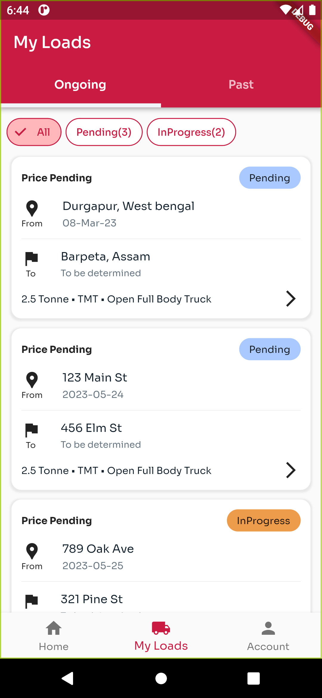
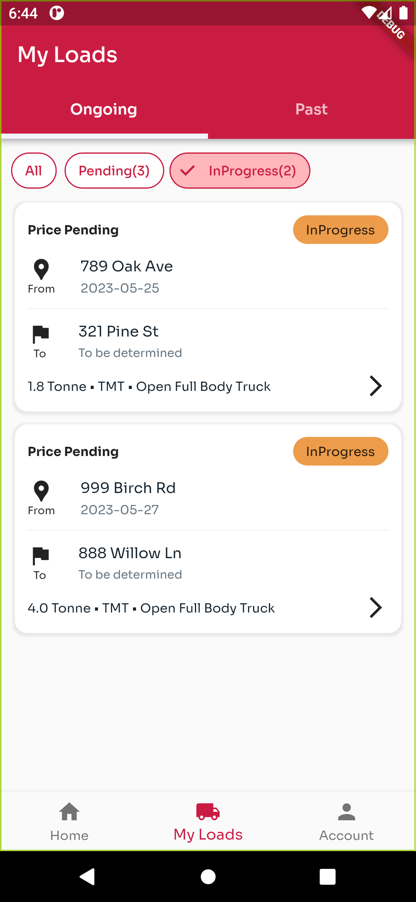
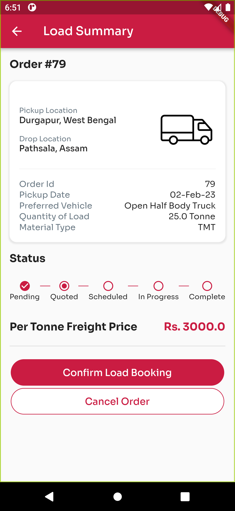
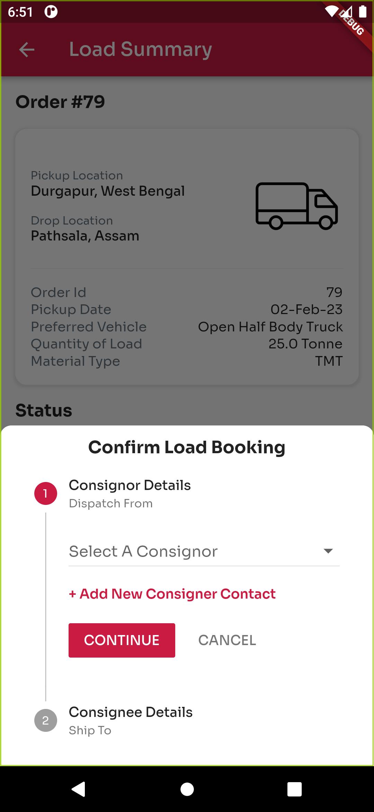
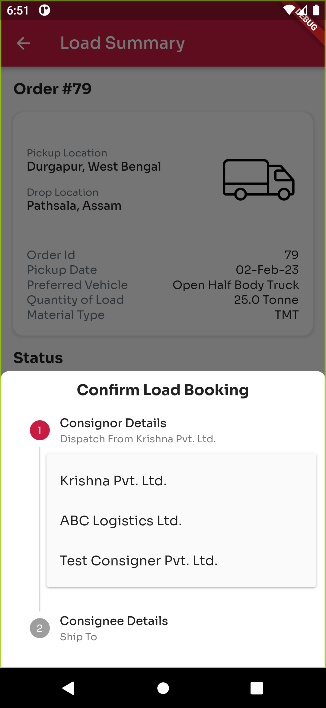
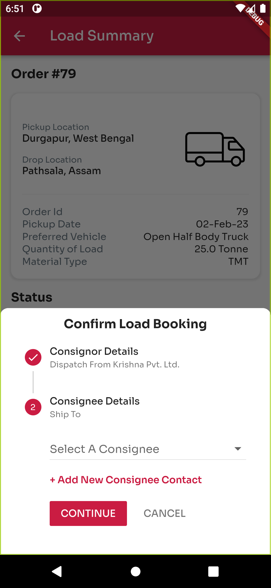

# Shyp Flutter App Readme

## Description

This Flutter project is designed to implement three screens that display details of ongoing and pending orders for a shipper subscribed to the Shyp platform. The three screens are as follows:
1. **Screen 1 (Orders) :** This screen displays the ongoing and pending loads for a specific user. It supports scrolling to accommodate multiple orders that do not fit on a single screen.


2. **Screen 2 (Track Load) :** This screen provides detailed information about a specific load, including the details of each truck attached to the load.

3. **Screen 3 (Confirm Booking) :** When a user clicks on "Confirm Booking" in the previous screen, a two-stepper popup is displayed on this screen.




## Running the App
Please follow the instructions below to run the application:

1. Clone the repository from GitHub: [Github Repository](https://github.com/shivsarthak/shyp_task)
2. Open the cloned project in your preferred Flutter development environment .
3. Ensure that you have the Flutter SDK installed. If not, refer to the official Flutter documentation for installation instructions: 
4. Install the required dependencies by running the following command in the terminal:
```
flutter pub get
```
5. Once the dependencies are successfully installed, connect a physical device or start an emulator/simulator.
6. Run the application using the following command:
```
flutter run
```
